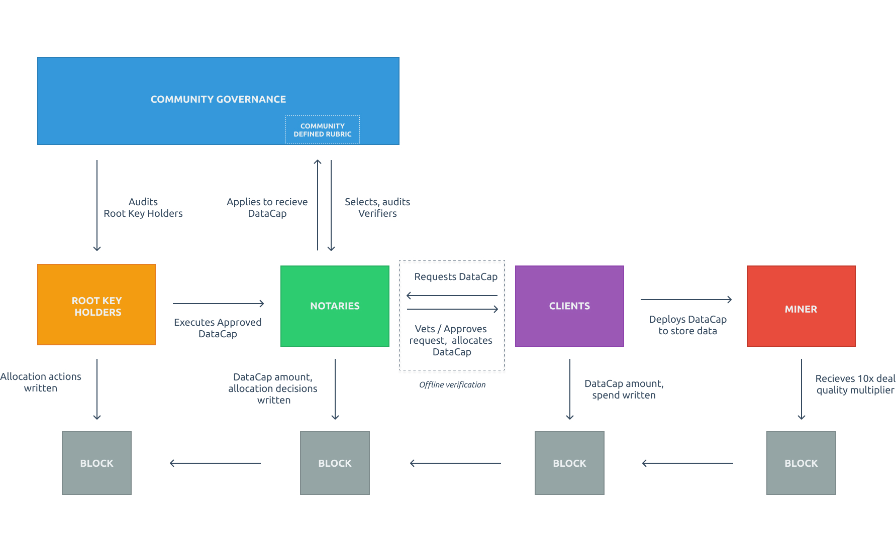

# This Repo is no longer maintained 
*This repository for the Fil+ Notaries has been sunset.  The updated repositority for ALLOCATORS has been created and is now maintained at [Github Goverance Repo](https://github.com/filecoin-project/Allocator-Governance)*

To view other updated reference links for the Fil+ program, please see
- For information on the open and pending DataCap deals, please see [FIDL's Allocator.tech](https://allocator.tech)
- For information on support issues or a listing of all current Allocators, please see [Allocator Registry](https://github.com/filecoin-project/Allocator-Registry)
- For getting in touch, please reach out in [SLACK](https://filecoinfoundation.slack.com/archives/C01DLAPKDGX)
- Bi-weekly recorded Fil+ governance meetings on [Youtube](https://www.youtube.com/playlist?list=PLp3zrT1ewY0kYN1hJpERMUxTCbFC4yZwN)

________________________
________________________
________________________
________________________

## Notary Program Overview (Now Sunset)

The purpose of this repository is to manage the governance and evolution of specific Mechanisms and Operations of the program as insantiated in this [FIP](https://github.com/filecoin-project/FIPs/blob/master/FIPS/fip-0003.md)

Within this repository, you will find: 
- Increased specification, governance, and evolution for Mechanisms and Operations layers.
- Information on Root Key Holders, available actions, roles and responsibility.
- Information on how to become a Notary, selection rubric, recommended guidelines, active Notaries.
- Information on how to file a Dispute, and the steps for how disputes are resolved. 

#### If you are looking to request DataCap or to find a list of active Notaries please go to the [Filecoin Plus Registry](https://plus.fil.org).

## Overview
- Principles
  - Decentralization and Diversity
  - Tranparency and Accountability
  - Community Governance
  - Low-Cost Dispute Resolution
  - Limited Trust Earned over Time
  - Terms of Service
  - A Useful Storage Network
- Roles & Responsibilities
  - [Root Key Holders](/root-key-holders#overview)
  - [Notaries](/notaries#overview)
  - Clients
- Interaction Diagram

## Dispute / Audit Framework

 Last updated: 2023-05-05	

**The person opening the dispute is referred to as ‘Claimant’ and the stakeholder against which the dispute is opened is referred to as ‘Responder'**

Overview of the Dispute resolution process: 
- Claimant submits [form](https://forms.gle/WTPCxsi12PLVzjWh8) in the [T&T Dispute Tracker](https://www.notion.so/filecoin/T-T-Dispute-Tracker-d28b93677cb544b48e77b585856601cf).
- Responder is notified by the T&T WG Lead and allowed to submit additional details in the [T&T WG slack](https://filecoinproject.slack.com/archives/C0405HANNBT) or present at the [T&T WG Call](https://calendar.google.com/calendar/event?action=TEMPLATE&tmeid=cXZkdjZ1MThkZ2w3MHFkMTM0YTdoZ2RtbmFfMjAyMzA1MTZUMTUzMDAwWiByYWdoYXYuYWdnYXJ3YWxAcHJvdG9jb2wuYWk&tmsrc=raghav.aggarwal%40protocol.ai&scp=ALL).
- T&T WG reviews all relevant data.
- Repercussions announced and enacted.

The process for filing a Dispute request is as follows:

An issue must be filed on the [T&T Dispute Tracker](https://www.notion.so/filecoin/T-T-Dispute-Tracker-d28b93677cb544b48e77b585856601cf)using the [form](https://forms.gle/WTPCxsi12PLVzjWh8)

*Although the WG prefers and strongly encourage full transparency, we understand some situations may require more discretion, so disputes can be submitted as 'anonymous'.*

Once a dispute is filed, the T&T WG Lead will discuss it in the WG calls. The average time for a dispute to be resolved is two weeks based on the principles of optimistic governance but some disputes may take longer depending on the complexity and response times of the claimant and responder. The status will be trackable and updated at all times in the public dispute tracker.

*Claimants are encouraged to cross-post the dispute in the T&T WG channel to bring the community’s attention to the dispute.*

The claimant is requested to complete all fields including a description of the issue at hand. Notably, some specific abuse must be detailed, such as:

- A violation of the overarching principles
- A violation of a Notary's own attested allocation plan
- A violation of the agreed-upon [operating guidelines](https://github.com/filecoin-project/notary-governance/blob/main/notaries#operational-guidelines), or some other act of impropriety 

Supporting the dispute with substantiating evidence is highly encouraged, such as links to the relevant transaction ids on-chain, screenshots, or other evidence.

Claimants are discouraged from making personal attacks against any stakeholder when submitting details in the T&T dispute tracker and follow the [Fil+ Code of Conduct](https://medium.com/filecoin-plus/fil-code-of-conduct-9cd044e7bcaf).

Based on the evidence, the response to a dispute, and discussions of the situation in the T&T WG calls, some possible repercussions and outcomes may include but are not limited to:

- Removal from the program 
- Losing rights as a notary
- Revoking of allocated DataCap
- Being asked to step away from the Fil+ community 
- A warning coupled with restrictions

## Governance, Contributing and Iteration Process 
Within this repository are the governing documents, selection criteria, and processes for Notaries and Root Key Holders. Areas for discussion or improvement, should be filed as issues. Please use the Modification template (for proposed improvements) or create a blank issue for topics for discussion!

After community discussion, pull requests are encouraged where open discussion can happen asynchronously via the community - please be sure to link the relevant issues to the changes in your PR. Similar to a FIP, any proposed changes must be done within the constraints of improving the Mechanisms and Operations to better meet the overarching Principles.

Please note our community governance calls will take place every other Tuesday - there are (2) calls each day to accomodate time zones. 8am PT // 1400 UTC AND 1800PT // 0000am UTC. Please see the community calendar for the accurate dates/times relative to your local timezone, follow the repo (where agenda issues will be filed), or join our Slack channel!
- [Community Calendar](https://calendar.google.com/calendar/u/1?cid=Y19rMWdrZm9vbTE3ZzBqOGM2YmFtNnVmNDNqMEBncm91cC5jYWxlbmRhci5nb29nbGUuY29t)
- [Zoom link](https://fil-org.zoom.us/my/filecoinplus?pwd=VHpNSnd0dkJRdWozNi9Xc3NmeGFhZz09), Passcode: *N*otary
- Please join our Slack channel, #fil-plus, if you have questions. 

### Previous governance calls

#### Recordings
- ALL: [Meeting recording](https://www.youtube.com/playlist?list=PL_0VrY55uV1-cwaAU8lcChONxYQ_Bj9hx)

#### Presentations
- ALL: [Presentation Files](https://drive.google.com/drive/u/0/folders/1zTy6YZWlG0KH6eQCEoKA8nDRP2JZnnp1)

