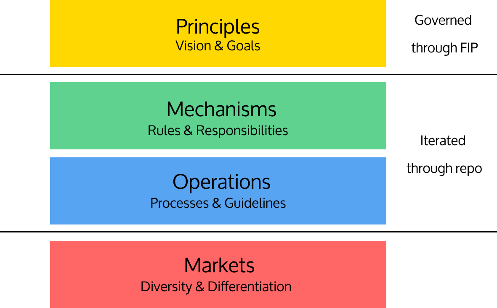

# Notary Governance
⚠️⚠️⚠️ ***This is still Work In Progress but one can follow the repository for the latest discussion and changes. If you are interested in becoming a Notary, please submit an issue in the repository so the maintainers can score according to the rubric and provide feedback.***

The purpose of this repository is to manage the governance and evolution of specific Mechanisms and Operations of the program as insantiated in this [FIP](https://github.com/filecoin-project/FIPs/blob/fip-0003/FIPS/fip-0003.md) and illustrated in the following diagram.

Within this repository, you will find: 
- Increased specification, governance, and evolution for Mechanisms and Operations layers.
- Information on Root Key Holders, available actions, roles and responsibility.
- Information on how to become a Notary, selection rubric, recommended guidelines, active Notaries.
- Information on how to file a Dispute, and the steps for how disputes are resolved. 

## Overview
- Principles
  - Decentralization and Diversity
  - Tranparency and Accountability
  - Community Governance
  - Low-Cost Dispute Resolution
  - Limited Trust Earned over Time
  - Terms of Service
  - A Useful Storage Network
- Roles & Responsibilities
  - [Root Key Holders](/root-key-holders#overview)
  - [Notaries](/notaries#overview)
  - Clients
- Interaction Diagram

## Dispute / Audit Framework
TBD

## Governance and Iteration Process 
Within this repository are the governing documents, selection criteria, and processes for Notaries and Root Key Holders. Improvements to these documents and processes may be proposed via Pull Requests - where open discussion can happen asynchronously via the community. Similar to a FIP, any proposed changes must be done within the constraints of improving the Mechanisms and Operations to better meet the overarching Principles.

Please note our community governance calls will take place every other **Tuesday (starting 2020.11.10) at 5pm UTC**. 
- [Community Calendar](https://calendar.google.com/calendar/u/1?cid=Y19rMWdrZm9vbTE3ZzBqOGM2YmFtNnVmNDNqMEBncm91cC5jYWxlbmRhci5nb29nbGUuY29t)
- [Zoom link](https://protocol.zoom.us/j/93414028246), Passcode: 554538
- Please join our Slack channel, #fil-plus, if you have questions. 

